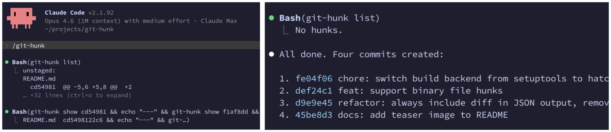

# git-hunk

[](https://pypi.python.org/pypi/git-hunk)
[](https://pypi.python.org/pypi/git-hunk)

Non-interactive git hunk staging for AI agents.



## Why?

`git add -p` is interactive, so AI agents can't (really) use it. `git-hunk` gives
every hunk a stable ID so agents can inspect, filter, and stage changes
programmatically.

## Highlights

- Non-interactive alternative to `git add -p` (no interactive prompts)
- Stage, unstage, and discard individual hunks by ID and lines (`-l 3,5-7` or `-l ^3,^5-7`)
- JSON output via `--json`

## Getting started

```bash
uv tool install git-hunk        # or: pip install git-hunk
npx skills add wkentaro/git-hunk  # for Claude Code, Codex, etc.
```

You edit a bunch of files, then tell your agent to split the changes:

```
> /git-hunk
```

It figures out which hunks go together and commits them separately:

```
$ git log --oneline
a1b2c3d feat: add validation for user input
d4e5f6a fix: handle empty response in API client
```

## Usage

### List hunks

```bash
git-hunk list                          # all hunks (unstaged + staged + untracked)
git-hunk list --unstaged               # unstaged hunks only
git-hunk list --staged                 # staged hunks only
git-hunk list src/foo.py src/bar.py    # specific files
git-hunk list --json                   # JSON output
```

### Show hunks

```bash
git-hunk show d161935                  # show a single hunk
git-hunk show d161935 a3f82c1          # show multiple hunks
git-hunk show --all                    # show all hunks (staged + unstaged)
git-hunk show --all --staged           # show all staged hunks
git-hunk show --all --unstaged         # show all unstaged hunks
```

### Stage, unstage, discard

```bash
git-hunk stage d161935                 # stage a hunk
git-hunk stage d161935 a3f82c1         # stage multiple hunks
git-hunk stage d161935 -l 3,5-7        # stage specific lines only
git-hunk unstage d161935               # move back to working tree
git-hunk unstage d161935 a3f82c1       # unstage multiple hunks
git-hunk unstage d161935 -l 3,5-7      # unstage specific lines only
git-hunk discard d161935               # restore from HEAD
git-hunk discard d161935 a3f82c1       # discard multiple hunks
git-hunk discard d161935 -l ^3,^5-7    # discard excluding specific lines
```

## How it works

1. Parses `git diff` output into individual hunks
2. Assigns each hunk a stable, content-based ID (SHA-256 prefix)
3. For staging: reconstructs a minimal patch and pipes it through `git apply --cached`
4. For discarding: reconstructs a reverse patch and applies it to the working tree

## Contributing

Bug reports, feature requests, and pull requests are welcome on
[GitHub](https://github.com/wkentaro/git-hunk).

## License

git-hunk is licensed under the MIT license ([LICENSE](LICENSE) or
<https://opensource.org/licenses/MIT>).
