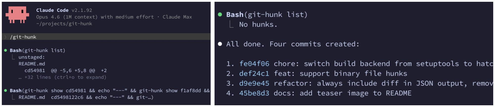

# git-hunk

[](https://pypi.org/project/git-hunk/)
[](https://pypi.org/project/git-hunk/)
[](https://pypi.org/project/git-hunk/)
[](https://github.com/wkentaro/git-hunk/actions/workflows/test.yml)

Non-interactive, programmatic alternative to `git add -p`.

Every staged or unstaged Hunk gets a durable ID so you can inspect, filter, and
stage changes without interactive prompts. Duplicate Hunks get unique
Conditional IDs.



## Why?

`git add -p` requires interactive input. That makes it unusable for:

- **AI agents** (Claude Code, Codex, etc.) that need to split changes into logical commits
- **Scripts & CI/CD** that automate commit organization
- **Editor integrations** that want hunk-level staging without shelling out to a TUI

`git-hunk` solves this by assigning each staged or unstaged Hunk a durable ID
and exposing simple stage/unstage/discard commands.

## Install

Requires Git 2.28 or later. `git-hunk` forces canonical diff paths with
`git diff --no-relative`, which earlier versions of Git do not accept.

```bash
pip install git-hunk
```

Or with [uv](https://docs.astral.sh/uv/):

```bash
uv tool install git-hunk
```

Verify it works:

```bash
git-hunk --version
```

### For AI agents

A usage guide ships inside the CLI, so agents (Claude Code, Codex, etc.) can
load it on demand. It always matches the installed version, so it never goes
stale:

```bash
git-hunk skills get core
```

`core` covers the tool itself. A separate `logical-commits` skill covers how to
group hunks into commits and order them; it is optional, so a project that
already defines its own commit conventions can load `core` alone:

```bash
git-hunk skills                           # list available skills
git-hunk skills get core logical-commits  # load both
```

`git-hunk --help` points here first.

## Quick start

```bash
# See all hunks across staged, unstaged, and untracked files
git-hunk list

# Show the diff for a specific hunk
git-hunk show d161935

# Stage specific hunks, then commit
git-hunk stage d161935 a3f82c1
git commit -m "feat: add validation for user input"

# Stage the remaining hunks
git-hunk stage e7b4012
git commit -m "fix: handle empty response in API client"
```

## Usage

### Repository paths

A Repository path is relative to the worktree root, uses `/`, and has the same
meaning from every invocation directory. Every path in output and every file
operand for `list`, `stage`, `unstage`, `discard`, and `commit` is a Repository
path. A leading `./` and internal `..` components are normalized. Absolute paths
and paths that escape the worktree are rejected.

File operands select one exact changed file. Directories, globs, and Git pathspec
syntax are not expanded. Quote operands that contain shell metacharacters so the
shell passes them unchanged. For example, from `sub/`, `same.txt` selects the
file at the worktree root, while `sub/same.txt` selects the file inside `sub/`.
`show` remains ID-only.

### Unsupported repository states

git-hunk rejects detected rename, copy, and unmerged index states before it
writes inventory output or changes the repository. This prevents partial JSON,
partial inventory, false clean results, and partial mutation. Resolve an
unmerged index with Git before retrying. Full rename and copy support is not yet
available; it remains tracked in [#53](https://github.com/wkentaro/git-hunk/issues/53).

### Hunk IDs

A canonical Hunk ID is a full SHA-256 value. JSON returns it in full. Human
output shows the shortest unambiguous prefix of at least seven characters, and
commands accept unambiguous prefixes without case sensitivity. IDs are
calculated from the combined staged and unstaged inventory, including when a
status filter shows only one side.

An Unchanged Hunk keeps its ID when it moves completely between staged and
unstaged state or when other complete Hunks move. A partial-line operation
creates new Hunks with new IDs.

Hunks with the same Repository path and patch content form a Duplicate Hunk
group. Each member gets a unique Conditional Hunk ID, shown with a
`conditional` label in human output and `"id_stability": "conditional"` in JSON.
The ID can change when its Duplicate Hunk group changes. After a partial-line
operation or an operation on a Conditional Hunk ID, address anything remaining
by Repository path, which is ID-independent, or run `git-hunk list` again for
the new IDs.

### List hunks

```bash
git-hunk list                          # all hunks (unstaged + staged + untracked)
git-hunk list --unstaged               # unstaged hunks only
git-hunk list --staged                 # staged hunks only
git-hunk list src/foo.py src/bar.py    # specific files
git-hunk list --json                   # JSON output for scripting
```

### Show hunks

```bash
git-hunk show                          # show all hunks (staged + unstaged)
git-hunk show d161935                  # show a single hunk
git-hunk show d161935 a3f82c1          # show multiple hunks
git-hunk show --staged                 # show all staged hunks
git-hunk show --unstaged               # show all unstaged hunks
```

### Stage, unstage, discard

```bash
git-hunk stage d161935                 # stage a hunk
git-hunk stage d161935 a3f82c1         # stage multiple hunks
git-hunk stage d161935 -l 3,5-7        # stage specific lines only
git-hunk stage d161935 --exclude-matching debug    # stage all but lines containing "debug"
git-hunk stage d161935 --include-matching xfail    # stage only lines containing "xfail"
git-hunk unstage d161935               # move back to working tree
git-hunk unstage d161935 -l 3,5-7      # unstage specific lines only
git-hunk discard d161935               # restore from the index
git-hunk discard d161935 -l ^3,^5-7    # discard excluding specific lines
```

`--include-matching` / `--exclude-matching` select changed lines by content
instead of line number (literal substring by default, `--regex` for regular
expressions). Both are repeatable and OR'd, case-sensitive, and error if nothing
matches. They are mutually exclusive with `-l` and with each other.

Line selection accepts any subset of a pure addition, pure deletion, or
one-for-one replacement. A grouped replacement with multiple deleted or added
lines must be selected as a whole or not selected. Numeric range endpoints are
checked against the Hunk before expansion, and no-newline state is preserved for
each patch side. Submodule pointer changes and whole-file Hunks do not support
line selection. Select the Hunk as a whole.

A binary, mode-only, type, or empty tracked file change is a whole-file Hunk.
Plain output labels empty tracked changes as `Empty file (added)` or
`Empty file (deleted)`. When one file has a mode change and text edits, the mode
and each text range are separate Hunks. Selecting text does not apply the mode
change, and selecting the mode Hunk does not apply text.

### Commit

```bash
git-hunk commit d161935 -m "fix: ..."      # stage a hunk and commit it in one step
git-hunk commit d161935 -l 3,5-7 -m "..."  # stage specific lines and commit
git-hunk commit d161935 --exclude-matching debug -m "..."  # commit all but matching lines
```

`commit` aborts if anything is already staged, so the commit contains exactly
the selected hunks. It accepts the same `-l`, `--include-matching`,
`--exclude-matching`, and `--regex` selection options as `stage`.

### JSON output

```bash
git-hunk list --json     # inventory: every hunk, no body
git-hunk show <id> --json # the same hunks plus a structured per-line body
```

Both emit a versioned envelope (`schema_version` is currently `2`) so consumers
can depend on a stable shape. `list --json` is a lean inventory and carries no
body; `show --json` adds a structured `lines` array. A `show --json` hunk
(`list --json` is identical but without the `lines` field):

```json
{
  "schema_version": 2,
  "hunks": [
    {
      "id": "d161935000000000000000000000000000000000000000000000000000000000",
      "id_stability": "stable",
      "file": { "text": "src/main.py" },
      "status": "unstaged",
      "change_kind": "M",
      "a_mode": "100644",
      "b_mode": "100644",
      "binary": false,
      "header": "@@ -10,3 +10,5 @@",
      "context_before": { "text": "def main():" },
      "additions": 2,
      "deletions": 0,
      "lines": [
        { "n": 1, "op": " ", "content": { "text": "    x = 1" } },
        { "n": 2, "op": "+", "content": { "text": "    y = 2" } }
      ]
    }
  ]
}
```

| Field            | Type           | Description                                                                                                                                                                            |
| ---------------- | -------------- | -------------------------------------------------------------------------------------------------------------------------------------------------------------------------------------- |
| `schema_version` | int            | Envelope version; bumped on any incompatible change to the shape below.                                                                                                                |
| `hunks`          | array          | The hunks (empty array when there are no changes).                                                                                                                                     |
| `id`             | string         | Full canonical SHA-256 Hunk ID; empty for an `untracked` entry, which no command can address. Human output uses a unique prefix of at least seven characters.                          |
| `id_stability`   | string         | `stable` or `conditional`. An untracked inventory entry reports `stable`, but its empty `id` remains unaddressable.                                                                    |
| `file`           | union          | Repository path of the changed file, as a byte-safe `{text\|bytes}` union (see below).                                                                                                 |
| `status`         | string         | One of `staged`, `unstaged`, `untracked`.                                                                                                                                              |
| `change_kind`    | string         | Git status letter: `A` added, `D` deleted, `M` modified, `T` typechange (`R`/`C` reserved and currently rejected). Always present.                                                     |
| `a_mode`         | string \| null | 6-digit octal git mode on the pre-image side; `null` when that side does not exist.                                                                                                    |
| `b_mode`         | string \| null | 6-digit octal git mode on the post-image side; `null` when that side does not exist.                                                                                                   |
| `binary`         | bool           | Whether the change is binary. Always present.                                                                                                                                          |
| `header`         | string \| null | The bare `@@ -a,b +c,d @@` range for a text hunk; `null` for a whole-file hunk (binary, mode-only, type, or empty tracked file change) or an `untracked` inventory entry.              |
| `context_before` | union \| null  | The function/section name after a text hunk's `@@` header, as a `{text\|bytes}` union; `null` for a text hunk without a heading, a whole-file hunk, or an `untracked` inventory entry. |
| `additions`      | int            | Number of added lines.                                                                                                                                                                 |
| `deletions`      | int            | Number of removed lines.                                                                                                                                                               |
| `lines`          | array          | `show --json` only. The structured body; `[]` for a whole-file hunk. See below.                                                                                                        |

A `lines` entry is `{ "n", "op", "content", "no_newline"? }`:

| Field        | Type   | Description                                                                                         |
| ------------ | ------ | --------------------------------------------------------------------------------------------------- |
| `n`          | int    | 1-based position within the hunk body — the index `-l` line selection uses. Counts every body line. |
| `op`         | string | `" "` context, `"+"` addition, `"-"` deletion.                                                      |
| `content`    | union  | The line text **without** its leading op character, as a `{text\|bytes}` union.                     |
| `no_newline` | bool   | Present and `true` only when the line has no trailing newline; consumes no `n`.                     |

Any field carrying arbitrary git/source bytes (`file`, `context_before`,
`lines[].content`) is a byte-safe `{text | bytes}` union: `{"text": "..."}` for
valid UTF-8, else `{"bytes": "<base64>"}`. It is always an object, so consumers
have one code path and strict JSON parsers never see a lone surrogate.

Adding a new field is backward-compatible and does not change `schema_version`;
renaming, removing, or changing the type of an existing field bumps it. (Before
`schema_version` existed, `list --json` returned a bare array.)

## Comparison

|                  | Interactive | Programmatic | Hunk IDs | Line-level control | JSON output |
| ---------------- | ----------- | ------------ | -------- | ------------------ | ----------- |
| `git add -p`     | Yes         | No           | No       | Yes                | No          |
| `git add <file>` | No          | Yes          | No       | No                 | No          |
| **`git-hunk`**   | **No**      | **Yes**      | **Yes**  | **Yes**            | **Yes**     |

## How it works

1. Rejects detected rename, copy, and unmerged states.
2. Parses staged and unstaged `git diff` output into one combined Hunk inventory.
3. Assigns each Hunk a full canonical SHA-256 ID and a unique human prefix.
4. Gives members of a Duplicate Hunk group unique Conditional Hunk IDs.
5. For staging, reconstructs a minimal patch and pipes it through `git apply --cached`.
6. For discarding, reconstructs a reverse patch and applies it to the working tree.

Text IDs use the Repository path and patch body, including context and newline
state. They exclude `@@` ranges, section headings, and staged state. Whole-file
IDs include the actual binary, mode, or type change. This keeps an Unchanged
Hunk stable while complete Hunks move. A partial operation changes the patch
content and creates new IDs.

## Contributing

Bug reports, feature requests, and pull requests are welcome on
[GitHub](https://github.com/wkentaro/git-hunk).

```bash
git clone https://github.com/wkentaro/git-hunk.git
cd git-hunk
make setup   # install dependencies
make test    # run tests
make lint    # run linters
```

## License

MIT ([LICENSE](https://github.com/wkentaro/git-hunk/blob/main/LICENSE))
